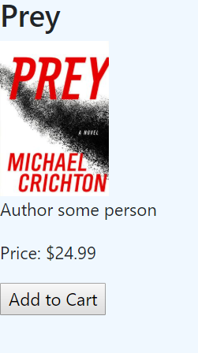
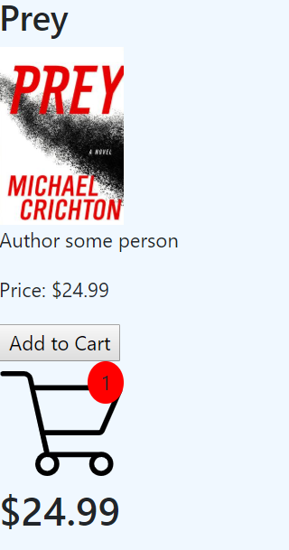

# almost-amazon
### Home Page

### Cliked view

## Purpose
The purpose of this project was a simple data structure file. We wanted to export functions from multiple JS files and import them into other functions for portability. The objective was to place an single item into a theoretical cart for the user to purchase down the line.

## To View

1. Clone repository to local machine.
1. Using http-server (`$ npm install http-server`) feed project to the port 8888 (`-p 8888`)
1. open localhost:8888 in your browser's address bar

## Notes
* This is not a high quality code for a user cart. There are a few hard coded set methods that would be unportable for multiple cart items
* Styling is minimal due to simple project specifications
* Cart item count will continue to rise while the cart total will not change